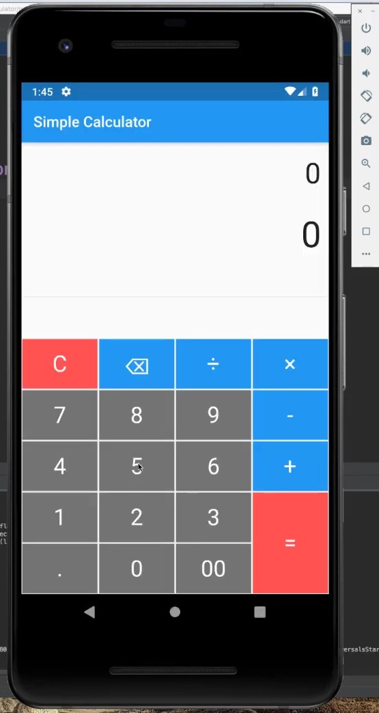

# Flutter Calculator Design



## Table of Contents

- [Introduction](#introduction)
- [Installation](#installation)
- [Technologies](#technologies)


## Introduction

Welcome to the Flutter Calculator project! This project is a simple, yet powerful calculator application developed using Flutter. It supports basic arithmetic operations and provides a clean, intuitive user interface.


## Installation

To get a local copy up and running follow these simple steps:

1. **Clone the repository**
    ```sh
    git clone https://github.com/ingabireol/Mobile_Assignment.git
    ```
2. **Navigate to the project directory**
    ```sh
    cd flutter-calculator
    ```
3. **Install dependencies**
    ```sh
    flutter pub get
    ```
4. **Run the app**
    ```sh
    flutter run
    ```

## Technologies

 In this project I used Flutter framework


